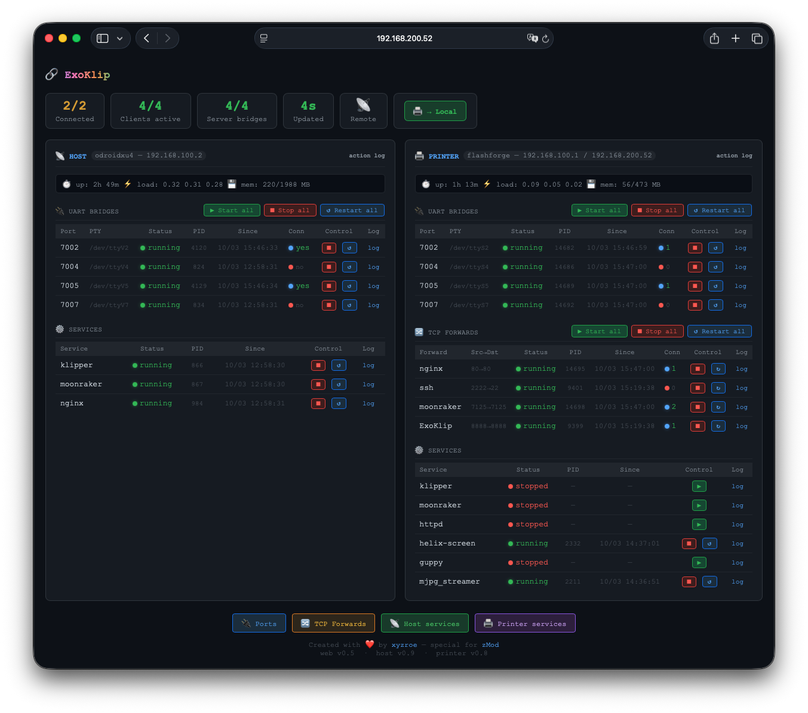
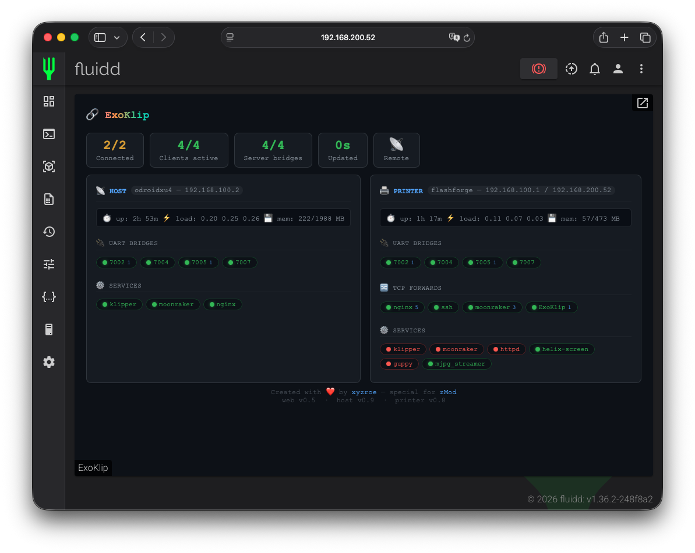

# ExoKlip

A bridge monitor and web UI for running Klipper, Moonraker and Fluidd on a separate ARM host (Odroid XU4) while the AD5X printer acts as a pure UART bridge. Serial ports of the printer are tunnelled over TCP using `socat` and appear as virtual ports (`/dev/ttyVx`) on the Odroid side.

The web UI provides a real-time dashboard for bridge status, systemd service control, operating mode switching (remote / local), action logs and syslog. Supports 6 languages with a built-in i18n engine (no external dependencies).

Files deployed to the **Odroid XU4** (ARM / Armbian / Debian) host and to the **AD5X printer** (MIPS).





---

## Files

### `bridge_monitor.py`
Main web server that runs on the Odroid.  
Pure Python 3, no external dependencies.

- Listens on `:8888`
- Serves the web UI from `html/`
- Polls `printer_api.py` on the printer (`192.168.100.1:8000`) for bridge/service status
- Manages `klipper-bridge-client@700x.service` units on the Odroid via `systemctl`
- Stores port list in `ports.conf` and client service list in `client_services.conf`

**Deploy path:** `/opt/bridge-monitor/bridge_monitor.py`

---

### `printer_api.py`
REST API server that runs **on the AD5X printer** (MIPS / BusyBox).  
Pure Python 3.8 stdlib, no dependencies.

- Listens on `:8000`
- Exposes bridge status, service status, action log, syslog
- Handles long-running actions asynchronously (`start`, `stop`, `restart`, `switch_remote`, `switch_local`)
- Tracks current operating mode (`remote` / `local`) in `/tmp/bridge-mode`

**Deploy path (printer):** `/usr/data/config/mod_data/bridge-api/printer_api.py`

**Run on printer:**
```sh
LD_LIBRARY_PATH=/usr/prog/Python-3.8.2/lib:/usr/prog/openssl-1.0.2d/lib \
  /usr/prog/Python-3.8.2/bin/python3 printer_api.py
```

---

### `bridge-monitor.service`
systemd unit for `bridge_monitor.py` on the Odroid.

**Deploy path:** `/etc/systemd/system/bridge-monitor.service`

```sh
sudo cp bridge-monitor.service /etc/systemd/system/
sudo systemctl daemon-reload
sudo systemctl enable --now bridge-monitor.service
```

---

### `S55bridge-api`
SysV-style init script that starts `printer_api.py` on the printer at boot.

**Deploy path (printer):** `/opt/config/mod/.shell/root/S55bridge-api`

```sh
S55bridge-api start | stop | restart | status
```

---

### `html/`
Web UI — single-page application, no build step, no external dependencies.

| File | Description |
|------|-------------|
| `index.html` | Main page; all static text uses `data-i18n` attributes |
| `app.js` | All frontend logic — polling, rendering, modals, actions |
| `style.css` | All styles; supports embed mode (`?embed=1`) |
| `i18n.js` | Lightweight i18n engine; reads from `langs/`; stores choice in `localStorage` |
| `langs/en.js` | English translations |
| `langs/ru.js` | Russian |
| `langs/uk.js` | Ukrainian |
| `langs/de.js` | German |
| `langs/pt.js` | Portuguese |
| `langs/cs.js` | Czech |

**Deploy path:** `/opt/bridge-monitor/html/`

The UI is accessible at **http://\<odroid-ip\>:8888**.  
Language selector is in the top-right corner. In embed mode (`?embed=1`) the selector and control buttons are hidden.

---

## Deployment

```sh
# Copy web files
sudo cp -r html/ /opt/bridge-monitor/html/

# Copy monitor script and service
sudo cp bridge_monitor.py /opt/bridge-monitor/
sudo cp bridge-monitor.service /etc/systemd/system/
sudo systemctl daemon-reload
sudo systemctl enable --now bridge-monitor.service

# Copy API and init script to the printer
scp printer_api.py root@192.168.100.1:/usr/data/config/mod_data/bridge-api/
scp S55bridge-api  root@192.168.100.1:/opt/config/mod/.shell/root/
ssh root@192.168.100.1 "/opt/config/mod/.shell/root/S55bridge-api start"
```

---

## Known Issues

### 1. `printer_api.py` must run as bare root on AD5X — no chroot

Direct access to `/dev/ttySx` character devices is required. Inside a **chroot** the device nodes are unavailable and `socat` fails to open them.

**Fix:** start the API from the native root filesystem, outside any chroot. The `S55bridge-api` script placed in `/opt/config/mod/.shell/root/` already satisfies this requirement.

### 2. Restarting Klipper on the printer does not work

The "Restart Klipper" action via the Web UI or `POST /api/action restart_klipper` is unreliable on the AD5X printer.

The BusyBox SysV script `S60klipper` does not correctly handle the `restart` verb.

### 3. No install / update mechanism via Moonraker

There is no `moonraker.conf` update manager section for this project. Installation and updates must be done manually by copying files to the Odroid and/or the printer as described in the Deployment section above.

**Workaround:** none at the moment. Contributions welcome.
